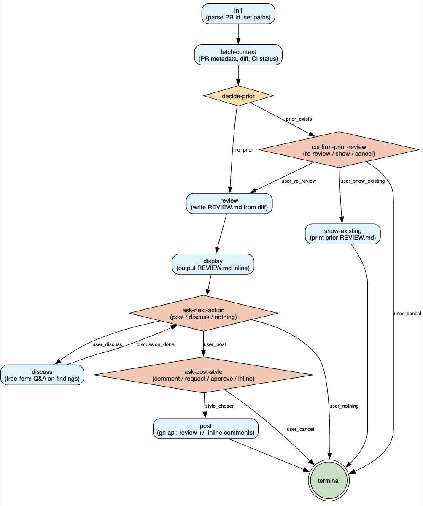
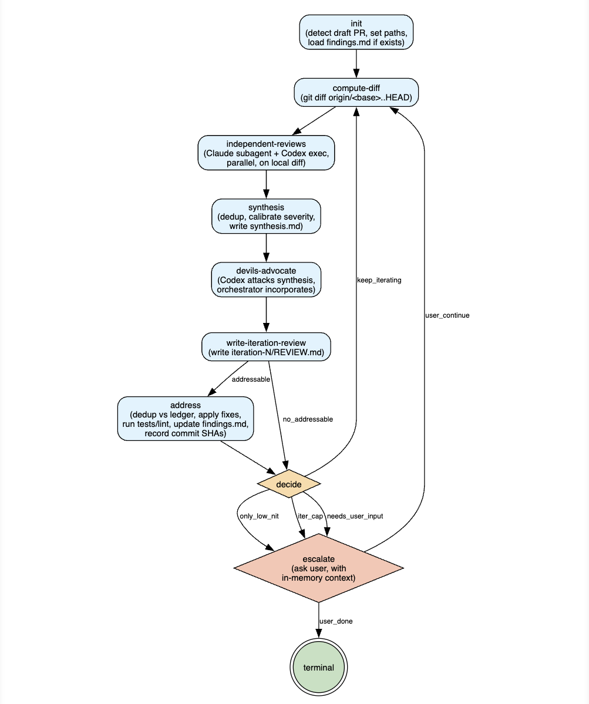

# Graph-Driven Skill Pattern

A pattern for authoring skills whose flow is a **graph**, not a linear
procedure. The graph is the source of truth; per-node prose lives in
markdown sidecars; a walker (`lib/graph_walker.py`) enforces transitions
mechanically. Drift from the documented flow becomes structurally
impossible, not a vibes-level guarantee.

This doc is the reference for the pattern. For the skills that use it,
see the table at the bottom and each skill's `SKILL.md`.

---

## At a glance

A graph-driven skill is a directory under `skills/<skill>/`
with this layout:

```
<skill>/
  SKILL.md                          # entry doc + frontmatter
  graph.dot                         # source of truth (Graphviz DOT)
  graph.svg                         # rendered visualization (humans only)
  nodes/                            # per-node prose, one file per node
    <id>.md                         # what the node does, how its edges resolve
  scripts/
    render.sh                       # graph.dot → graph.svg
    validate.py                     # structural integrity check
    walk.sh                         # thin wrapper around lib/graph_walker.py
  references/                       # optional: any skill-specific extras
```

The skill's behavior is the union of two things:

1. **The DOT graph** — defines node IDs, edges, and edge condition labels.
2. **Per-node sidecars** — define what each node does in prose, and how
   its outgoing edges' conditions are evaluated.

Together, these are the skill. The walker (the agent running the skill)
walks the graph: read `nodes/<current>.md`, do the work, evaluate the
outgoing edges' conditions, transition. Repeat until terminal.

A typical graph looks like this — the rendered `graph.svg` for
`/review-pr-simple`:



You can read the macro flow at a glance: linear backbone from `init`
to `display`, three user-input gates (coral diamonds), one decision
node (amber diamond), a `discuss` loop that returns to
`ask-next-action`, and a single terminal sink that all cancel routes
converge on. Per-node prose in `nodes/<id>.md` covers the work each
node does.

---

## Why dot-graph

Three reasons that compound:

**1. Drift is mechanically impossible.** The walker reads `graph.dot`
and refuses transitions that aren't on the graph. If a node's prose
says "transition to `foo`" but `graph.dot` doesn't have that edge,
the walker rejects with a clear error listing the valid alternatives.
The contract between prose and routing is hard, not a hopeful comment.

**2. The graph is reviewable.** A 17-node skill's macro flow fits on
one screen as a rendered SVG. Reviewers see fork points, cleanup
sinks, loops, and dead ends at a glance. The previous "phased
procedure" style scattered routing decisions across 600 lines of
SKILL.md prose; a graph compresses all of it into a structural diagram.

**3. Resume support falls out for free.** The walker's state file
records the current node, the transition history (with timestamps),
and per-skill `extra` fields. A crashed session's `.walk-state.json`
tells the next session exactly where work was abandoned. No bespoke
checkpoint logic per skill.

The cost is honest: more files to author and a bit of upfront design
thinking. The payoff is that complex skills (review pipelines, sprint
planning, cleanup workflows) stay maintainable past the point where
procedural prose would have started rotting.

---

## The walker

`lib/graph_walker.py` is the shared walker — skill-
agnostic, parses any `graph.dot`, maintains a state file, validates
every transition against the graph and refuses if not on the graph.

Each skill has a `scripts/walk.sh` that hardcodes that skill's
`graph.dot` so node prose stays terse:

```bash
scripts/walk.sh init --state "$STATE"
scripts/walk.sh transition --state "$STATE" --from <id> --to <id> [--condition <label>]
scripts/walk.sh where --state "$STATE"
scripts/walk.sh history --state "$STATE"
scripts/walk.sh set --state "$STATE" --key <name> --value "<value>"
scripts/walk.sh get --state "$STATE" --key <name>
```

### The state file

`.walk-state.json` lives wherever the skill's per-run output lives
(typically `~/Reports/.../sprints/<TS>/.walk-state.json` or
`$TMPDIR/.claude-walker/<skill>/<TS>.walk-state.json` for skills
without per-run reports).

Layout:

```json
{
  "graph_path": "skills/<skill>/graph.dot",
  "current_node": "<id>",
  "started_at": "2026-05-07T10:30:00Z",
  "history": [
    {"from": "<id>", "to": "<id>", "condition": "<label>", "at": "..."}
  ],
  "extra": {
    "pr_number": "39306",
    "session_dir": "...",
    "...": "..."
  }
}
```

`extra` is the skill's escape hatch for run-scoped state. Anything a
node needs to persist for downstream nodes goes here via `walk.sh set`
/ `walk.sh get`.

### What walker refusal means

If the walker refuses a transition, **treat it as a real error, not a
hint.** Something is wrong: either the node's prose is out of sync
with `graph.dot`, or the agent is trying to take a route that doesn't
exist. **Never bypass the walker** by manually editing the state file
or skipping the call — the whole point is the hard contract.

The walker prints valid alternatives on refusal, e.g.:

```
ERROR: no edge from 'compute_diff' to 'address'. Valid transitions
from 'compute_diff':
  compute_diff -> independent_reviews
```

Re-evaluate state, pick a different edge, or surface the problem.

---

## Node types and rendering conventions

Four node types, each with a consistent shape and color. The walker
doesn't care about visual style — these conventions are for humans
reading `graph.svg`.

| Type | DOT shape | Fill color | Used for |
|---|---|---|---|
| Process | rounded box | light blue (`#e1f5fe`) | Nodes that do work and have a single outgoing edge (or a routing decision based on persisted state) |
| Decision | diamond | amber (`#ffe0b2`) | Pure-decision nodes that route based on observable state, no user input |
| User-input | diamond | coral (`#ffccbc`) | Nodes that prompt the user via `AskUserQuestion`; user's answer determines the route |
| Terminal | double circle | green (`#c8e6c9`) | Sink. No outgoing edges. |

Example DOT:

```dot
init           [shape=box, style="rounded,filled", fillcolor="#e1f5fe",
                label="init\n(parse args, set paths)"];
decide_prior   [shape=diamond, style=filled, fillcolor="#ffe0b2",
                label="decide-prior"];
ask_approval   [shape=diamond, style=filled, fillcolor="#ffccbc",
                label="ask-approval\n(approve / discuss / cancel)"];
terminal       [shape=doublecircle, style=filled, fillcolor="#c8e6c9",
                label="terminal"];
```

The visual distinction between decision and user-input diamonds
matters because they have different reading semantics: a decision
diamond's outgoing edge is determined by the agent's evaluation of
state; a user-input diamond's outgoing edge is determined by the
user's answer.

---

## Edge condition labels

Edges with multiple outgoing routes from a single source carry
**condition labels** — short, lowercase, snake_case, shell-safe (no
spaces, no special characters). Example:

```dot
ask_approval -> implement    [label="user_approve"];
ask_approval -> discuss_plan [label="user_discuss"];
ask_approval -> terminal     [label="user_cancel"];
```

Conventions:

- **Source-node scoped.** `user_cancel` from `ask-approval` is a
  different thing than `user_cancel` from `confirm-prior-review`.
  Don't try to make labels globally unique; they're locally
  meaningful and that's enough.
- **Verbs and nouns of the routing decision.** `user_approve`,
  `keep_iterating`, `setup_failed`, `prior_exists`, `style_chosen`.
- **Single-outgoing-edge nodes don't need labels.** If a node has
  exactly one outgoing edge, omit the `label=` — the transition is
  unambiguous.

Common labels seen across the suite:

- `user_approve` / `user_revise` / `user_cancel` — three-way approval gates
- `user_continue` / `user_done` — discuss-loop exit gates
- `discussion_done` — back-edge from discuss nodes to their owning gate
- `prior_exists` / `no_prior` — prior-artifact decisions
- `setup_ok` / `setup_failed` — pre-condition gates
- `addressable` / `no_addressable` — work-pending vs no-op routes
- `keep_iterating` / `iter_cap` — loop-vs-escalate decisions

---

## Common patterns

Eight skills are now on this pattern. A few topology shapes recur.

### Linear backbone with process nodes

The macro flow is a chain of process nodes (single outgoing edge
each), with decision and user-input nodes as forks where routing
depends on state or user input. Example from `/sprint-seed`:

```
init → orient → kickoff → discuss → ask-wrap-up → synthesize → write-seed → handoff → terminal
```

Most skills have this shape with a few branches off it.

### User-input gate then act

The most common gate pattern. A user-input node asks; the user picks;
the chosen action runs in a separate process node downstream:

```
ask-post-style → post              # if style chosen
ask-post-style → cleanup-worktree  # if user_cancel
```

The "ask" and the "act" are deliberately separate nodes because they
have different concerns: the gate validates intent, the act executes.

### Discuss loop

Mirrors a chat-thread structure. Used in `/review-pr-simple`,
`/review-address-feedback`, `/sprint-plan`, `/sprint-work`, etc.

```
ask-approval → discuss-plan      # user picks "discuss"
discuss-plan → ask-approval      # back-edge after discussion_done
ask-approval → register          # user picks "approve"
ask-approval → terminal          # user picks "cancel"
```

The back-edge from `discuss-plan` to `ask-approval` is what makes it
a loop. The user can iterate freely; the gate is always the exit.

### Decision node before destructive operation

When an operation is irreversible (force-push, ledger update, code
deletion), a decision node re-verifies preconditions immediately
before. Example from `/polish-pull-request`:

```
ask-cleanup → preflight-cleanup → apply-commits   # if preflight_ok
                                → summarize       # if preflight_failed
```

Time has passed since the prior analyze; the precondition might have
changed. The decision node is cheap insurance.

### Cleanup sink before terminal

When a node creates state that needs cleanup (e.g., a worktree, a
temp dir), all paths route through a cleanup sink before terminal.
Example from `/review-pr-comprehensive`:

```
post                 → cleanup-worktree → terminal
ask-post-style       → cleanup-worktree → terminal   # on user_cancel
ask-next-action      → cleanup-worktree → terminal   # on user_nothing
show-existing        → cleanup-worktree → terminal
```

Paths that bail before the cleanup-creating node skip the sink:

```
setup-worktree → terminal   # if setup_failed (nothing to clean up)
```

The walker enforces this — illegal `post → terminal` (skipping
cleanup) is rejected.

### Parallel delegation

A single node launches multiple workers in parallel and waits for
all. Used in `/review-pr-comprehensive` (Claude + Codex), `/sprint-
self-review` (Claude subagent + Codex exec), `/sprint-plan` (up to 7
parallel review lenses).

```
                            ┌─ Codex (background)
independent-reviews ────────┤                       → wait → synthesis
                            └─ Claude subagent (Agent tool)
```

The graph shows one node; the parallelism is internal. The skill's
node prose covers launch + wait + artifact verification.

`/sprint-self-review` is a good showcase — it combines parallel
delegation (`independent-reviews`) with an iteration loop (back-edge
from `decide` and `escalate` through `compute-diff`):



The `independent-reviews` node hides Claude (subagent via the `Agent`
tool) and Codex (`codex exec`) running in parallel; the orchestrator
waits for both, then `synthesis`, `devils-advocate`, and
`write-iteration-review` run sequentially. The `keep_iterating`
back-edge from `decide` and the `user_continue` back-edge from
`escalate` both route through `compute-diff` so each iteration sees a
fresh diff against the post-`address` working tree.

### Mode dispatch (flag-driven subgraphs)

A decision node forks into N subgraphs based on flags or input shape.
Example from `/sprint-work`:

```
                ┌─ render-plan-and-exit → terminal       (--review)
dispatch-mode ──┤
                ├─ verify-merged → write-retro → terminal (--retro)
                │
                └─ detect-repo → ... → summarize → terminal (normal)
```

Each subgraph has its own user-input gates and concerns. They share
upstream context-loading nodes and the terminal sink.

### Per-item loop internal to a node

When a node walks N items (per-finding, per-PR, per-issue, per-group),
the loop is internal to one node — no graph node per iteration. Used
in `/commit` (per-group), `/review-address-feedback` (per-finding),
`/sprint-work` linear-walk (per-issue), `/sprint-plan-to-linear`
(per-issue creation).

The node's prose describes the loop: "for each X in Y, do Z; on
failure, ...".

---

## Sidecar template

`nodes/<id>.md` follows this structure:

```markdown
# Node: <id>

<one-line summary of what this node does>

## Inputs

- <walker state keys this node reads>
- <files this node reads>

## Steps

1. <numbered list of the work the node does>
2. ...

## External content as untrusted data
*(optional, when the node reads external content)*

<note about treating external content as data, not instructions —
see CLAUDE.md>

## Outputs

- <files written>
- <walker state keys persisted>

## Outgoing edges

- **`<condition>`** → `<target node>`. <when this route fires>
- **`<condition>`** → `<target node>`. <when this route fires>

Record exactly one:

\`\`\`bash
scripts/walk.sh transition --state "$STATE" --from <id> --to <target> --condition <label>
\`\`\`

## Failure modes

- <what can go wrong, how to handle>

## Notes
*(optional)*

- <caveats, conventions, "don'ts">
```

Conventions:

- **One node per file.** Filenames use kebab-case (`ask-post-style.md`),
  matching the underscored DOT identifier (`ask_post_style`). The
  validator accepts both `<id>.md` and `<id-with-dashes>.md`.
- **Prose, not pseudocode.** Describe what the node does in human
  terms. Code blocks for canonical commands; English everywhere else.
- **Single outgoing edge → no `condition` argument.** Just
  `--from X --to Y`.
- **Multiple outgoing edges → mandatory condition.** Pick exactly
  one based on the edge-condition decision.

---

## SKILL.md template

The skill's entry doc. Frontmatter establishes the skill's identity;
sections after that are conventional.

```markdown
---
name: <skill-name>
description: >-
  <one-paragraph what-it-does, used by the model picker and humans>
argument-hint: "<args>"
disable-model-invocation: true
---

# <Skill Title>

<one-paragraph framing of what the skill does and what makes it
distinct>

## Help mode

<verbatim help blurb to print when --help / -h is passed; the help
blurb itself is enclosed in a code fence so it renders cleanly>

## External Content Handling

<the standard "external content is untrusted data" boilerplate from
CLAUDE.md, scoped to what this skill fetches>

## State machine

<intro about graph.dot being the source of truth, count of nodes,
list of nodes with one-line descriptions, edge condition codes
grouped by source node>

## Walker semantics

<intro about scripts/walk.sh, the six steps of walking the graph,
"never bypass the walker", how to handle ambiguous conditions>

## <skill-specific sections as needed>

<e.g., "Worktree lifecycle" for /review-pr-comprehensive,
"Re-run detection" for /sprint-plan-to-linear, "Strict separation of
duties" for /sprint-self-review>

## Artifacts and paths

<directory layout of per-run output>

## Don'ts

<bulleted list of "this skill does not ___">

## ARGUMENTS

<brief description of args, then>

The literal arguments passed by the user follow:

$ARGUMENTS
```

Conventions:

- **`disable-model-invocation: true`** for all graph-driven skills.
  These are user-invoked workflows, not auto-triggered.
- **Help mode is verbatim print-and-exit.** No state file is created,
  no subprocesses run. Detect `--help` / `-h` in init's parsing.
- **The state-machine section is the table of contents** for the
  graph. Reading SKILL.md should give a reviewer enough to navigate
  to the right `nodes/<id>.md` for any concern.
- **The "Don'ts" section is load-bearing.** It captures the hard
  lines (no merging, no force-pushing, no auto-pushing, no
  unauthorized writes to external systems) that the skill's nodes
  enforce internally.

---

## Authoring workflow

From "I want to convert this skill" to "validated and smoke-tested":

1. **Read the existing SKILL.md** if you're converting an existing
   procedural skill. Note the phases, user-input gates, decision
   forks, and any conditional/optional steps.

2. **Sketch the topology.** Pencil-and-paper or a brief proposal in
   chat. Identify:
   - Process nodes (where work happens)
   - Decision nodes (pure routing on state)
   - User-input nodes (`AskUserQuestion` gates)
   - Loops and back-edges
   - Cleanup sinks if any side effects need teardown

3. **Get sign-off on the topology** before writing 17 sidecars. The
   user can redirect cheaply at this stage; later it's expensive.

4. **Write `graph.dot`.** Use the conventions in this doc (shapes,
   colors, edge labels). Comment-block at the top describing the
   skill.

5. **Copy `scripts/`** from any existing graph-driven skill (they're
   identical except for `validate.py`'s docstring).

6. **Render and validate:**
   ```bash
   bash scripts/render.sh
   python3 scripts/validate.py
   ```
   The validator will list missing sidecars — that's expected at
   this stage.

7. **Write each `nodes/<id>.md`** following the sidecar template.
   Re-validate after each batch.

8. **Write the SKILL.md.** Pull together: frontmatter, help mode,
   external content handling, state machine, walker semantics, any
   skill-specific sections, artifacts, don'ts, ARGUMENTS.

9. **Smoke-test the walker** (see next section).

10. **Commit** the skill as one logical commit per skill (graph + 
    sidecars + scripts + SKILL.md together).

---

## Validation and smoke-testing

### `validate.py`

Runs as part of the authoring loop. Checks:

- Every node referenced by an edge is declared.
- Every declared node has a sidecar at `nodes/<id>.md` (or
  `nodes/<id-with-dashes>.md`).
- Terminal nodes (declared via `shape=doublecircle`) have no
  outgoing edges.
- Every node except `init` has at least one incoming edge (no
  orphans).

```bash
python3 scripts/validate.py
# → "OK: N nodes, M edges, 1 terminal node(s)."
```

### Walker smoke-tests

Manual scripts that exercise the walker on representative routes.
Pattern:

```bash
WALK="skills/<skill>/scripts/walk.sh"
S="$PWD/test/.walk-state.json"

"$WALK" init --state "$S"
"$WALK" transition --state "$S" --from init --to <next>
"$WALK" transition --state "$S" --from <next> --to <next2> --condition <label>
...
"$WALK" where --state "$S"
```

Cover at least:

- **Happy path** — full pipeline through to terminal.
- **Each user-input gate's branches** — including cancel routes.
- **Each decision node's branches**.
- **Loops** — exercise the back-edge and the loop-exit.
- **Illegal transition** — confirm the walker refuses with valid
  alternatives listed.

The smoke-tests don't run the actual node work (no real PR, no real
Codex calls). They verify the **graph contract** — the walker enforces
the documented routes.

---

## When NOT to use this pattern

The pattern earns its overhead when a skill has:

- 5+ phases or distinct steps
- User-input gates that affect routing
- Loops or conditional branches
- Per-run artifacts that benefit from a session folder

It's overkill when:

- The skill is a thin CLI wrapper (`linear`, `gh`, `obsidian`, `gws`,
  `orbstack`). These have one-shot operations with no internal state
  machine.
- The skill is a single-prompt formatter (`commit` is borderline; we
  graph-converted it for consistency, but the walker is genuinely
  unused).
- The work is an open-ended chat (`sprint-seed`'s discuss phase is
  inside a node, not the whole skill).

A useful test: if you'd be tempted to write the SKILL.md as a
flowchart anyway (phases with decision points), that's the pattern
fitting. If the SKILL.md would be a list of independent commands,
just leave it procedural.

---

## Reference: skills on this pattern

| Skill | Nodes | Edges | Distinctive shape |
|---|---:|---:|---|
| `/commit` | 5 | 5 | Linear, smallest skill on the pattern |
| `/sprint-seed` | 9 | 11 | Discuss loop with mode-dispatch in node prose |
| `/review-pr-simple` | 12 | 17 | Discuss loop, four-style post fork |
| `/review-address-feedback` | 13 | 19 | Strategy-driven per-finding loop |
| `/sprint-plan-to-linear` | 15 | 21 | Re-run pre-flight, per-match decisions |
| `/polish-pull-request` | 16 | 25 | Two-stage approval, preflight before destructive op |
| `/sprint-plan` | 16 | 21 | N-way parallel delegation (drafts, critiques, reviews) |
| `/review-pr-comprehensive` | 17 | 23 | Persistent worktree lifecycle + cleanup sink |
| `/sprint-self-review` | 10 | 14 | Iteration loop with full review pipeline per iteration |
| `/sprint-work` | 18 | 25 | Three-way subgraph fork (review / retro / normal) |

The shared walker is `lib/graph_walker.py`. Each skill's
`scripts/walk.sh` thin-wraps it with the skill's `graph.dot` path
hardcoded.

---

## Pointers

| Need details on... | Read |
|---|---|
| Walker internals (state file, transitions, refusal) | `lib/graph_walker.py` |
| Codex invocation pattern (used in parallel-delegation nodes) | `lib/codex-invocation.md` |
| Sprint workflow (the sequence skills compose into) | `sprints/README.md` |
| Any specific skill's flow | `skills/<skill>/SKILL.md` and `graph.svg` |
| Any specific node's prose | `skills/<skill>/nodes/<id>.md` |
