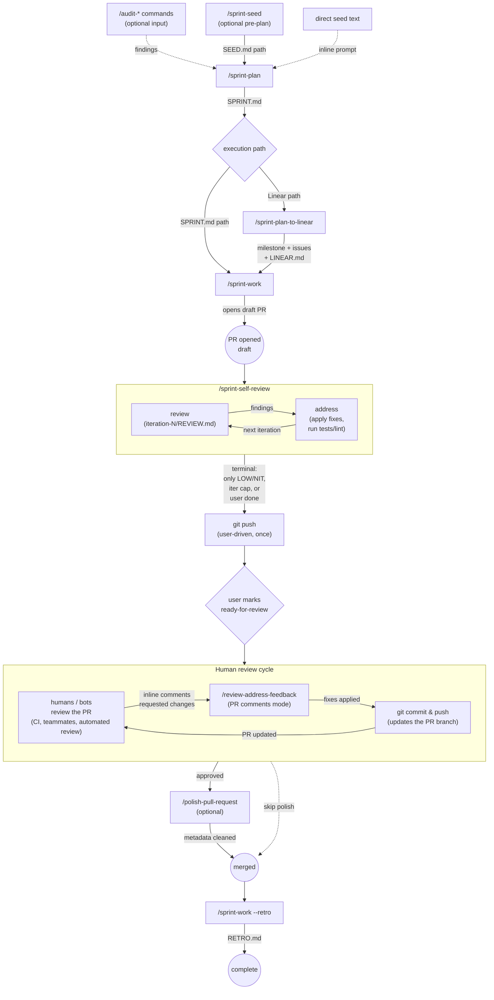

# Sprint Workflow

End-to-end lifecycle for planning, executing, reviewing, and shipping
work. Each stage has a dedicated skill; this doc shows
how they compose.

For details on any single skill's phases and inputs, see
`skills/<skill>/SKILL.md`.

---

## Lifecycle

*Renders natively on GitHub. In VS Code, install [Markdown Preview Mermaid Support](https://marketplace.visualstudio.com/items?itemName=bierner.markdown-mermaid) to render in the built-in preview.*



**Pre-plan options** feeding into `/sprint-plan` are all optional and
mutually-mixable: pass an audit report as the seed, write a `SEED.md`
via `/sprint-seed` first, or just hand `/sprint-plan` an inline seed
prompt directly.

**Two review/fix cycles** run before merge — first
`/sprint-self-review` against the local diff (no push, single skill
drives the whole loop), then humans and bots against the pushed PR
addressed via `/review-address-feedback`. See the *Two review/fix
cycles* section below for details.

---

## Skills by stage

| Stage | Skill | Output |
|---|---|---|
| Audit (optional input) | `/audit-architecture` `/audit-design` `/audit-security` `/audit-accessibility` | Findings written as sprint-able tasks |
| Pre-plan discussion (optional) | `/sprint-seed` | `SEED.md` (refined seed prompt + discussion summary) in a fresh session folder |
| Plan | `/sprint-plan` | `SPRINT.md` + supporting drafts/critiques/reviews |
| Capture in Linear | `/sprint-plan-to-linear` | Linear milestone + issues, `LINEAR.md` sidecar |
| Ledger | `/sprints` | `ledger.tsv`; lookup by `--current` / `--path <query>` (session prefix or title fragment) |
| Execute | `/sprint-work` | Auto-detects SPRINT.md vs Linear path from input. Code changes + PR(s) opened, multi-repo aware. |
| Self-review (pre-push, one-skill loop) | `/sprint-self-review` | Per-iteration `REVIEW.md` + `ADDRESSED.md`, rolled into a per-PR `findings.md` ledger |
| Review (single agent) | `/review-pr-simple` | `REVIEW.md` |
| Review (dual agent) | `/review-pr-comprehensive` | `REVIEW.md` (Claude + Codex synthesis) |
| Address feedback | `/review-address-feedback` | Code changes + `ADDRESSED.md` |
| Pre-merge polish (optional) | `/polish-pull-request` | Updated PR title/body + resolved stale threads |
| Retro | `--retro` flag on `/sprint-work` | `RETRO.md` |

---

## Two execution paths

Both start from the same `SPRINT.md`. Pick based on whether the team
operates from Linear or directly from the plan document.

### SPRINT.md path

```
/sprint-plan → /sprint-work → PR → review/fix cycle → merge → retro
```

Use when: solo work, small team, or work that doesn't need to be
visible to a broader Linear audience. Faster start; no Linear setup
overhead.

### Linear path

```
/sprint-plan → /sprint-plan-to-linear → /sprint-work [<query> | <LINEAR-ID>]
            → PR → review/fix cycle → merge → retro
```

`/sprint-work` auto-detects the Linear path when the session folder
has a `LINEAR.md` sidecar, or when the argument is a Linear issue ID
(`<LINEAR-ID>`), milestone name, or Linear URL.

Use when: team-visible work, or work that benefits from Linear's tracking
(milestones, priority, issue threading, GitHub-integration state
transitions, automated quality coaching).

The two paths are equally valid — they end at the same place (PR
opened, review cycle, merge, retro).

---

## Two review/fix cycles

A PR goes through two review/fix loops in this workflow:

1. **Self-review** (before reviewers see it) — driven by
   `/sprint-self-review`, a single skill that handles the whole loop
   internally on the local diff. No push between iterations.
2. **Human review** (after marking ready-for-review) — driven by the
   user manually alternating `/review-address-feedback` against the
   live PR's comments, with optional fresh agentic reads via
   `/review-pr-simple` or `/review-pr-comprehensive`.

### Self-review cycle

`/sprint-work` opens the PR as a draft. Before notifying reviewers,
run `/sprint-self-review` to iterate on the local diff. The skill
drives the entire loop, with strict separation of duties — the
orchestrator never reviews; both reviewers are fresh workers per
iteration:

- **compute-diff** — `git diff origin/<base>..HEAD` for the
  iteration.
- **independent-reviews** — Claude (subagent via the `Agent` tool)
  and Codex (`codex exec`) review the local diff in **parallel**.
  Both write to their own `iteration-N/{claude,codex}-review.md`
  with `CR-` and `CX-` prefixed findings respectively.
- **synthesis** — orchestrator merges, dedupes, calibrates severity
  to `iteration-N/synthesis.md` with `SR-` prefixed findings.
- **devils-advocate** — Codex attacks the synthesis; orchestrator
  incorporates valid challenges in place.
- **write-iteration-review** — orchestrator writes
  `iteration-N/REVIEW.md` from the (post-devils-advocate) synthesis.
- **address** — apply fixes the user approves, run project
  tests/lint to verify, update the per-PR `findings.md` ledger and
  record commit SHAs.
- **decide** — keep iterating, escalate to the user (only Low/Nit
  remain, iteration cap hit, or a finding needs the user's call),
  or loop back through compute-diff for a fresh diff.
- **escalate** — ask the user **continue** (next iteration) or
  **done** (exit).

The cycle exits at the escalation gate when the user picks **done**,
or earlier on the user's call if the skill gets stuck. The
findings.md ledger persists across runs on the same PR, so re-runs
don't repeat triage on findings already resolved or won't-fixed.

The skill doesn't push, doesn't undraft, and doesn't comment on the
PR. The user pushes once at the end (so CI runs against the final
self-reviewed state), then marks the PR ready-for-review (`gh pr
ready` or the GitHub UI). For details:
`skills/sprint-self-review/SKILL.md`.

### Human review cycle

Once the PR is ready-for-review, humans and bots (CI, teammates,
automated review tooling) leave inline comments. Address them with:

```
/review-address-feedback <PR-url>
```

The skill walks each comment with the user picking **fix** /
**skip** / **won't-fix** / **defer** / **discuss**. After fixes are
applied, push to the PR branch and let reviewers see the updated
state. Loop until everyone's approved.

Optionally, run `/review-pr-simple <PR-url>` or
`/review-pr-comprehensive <PR-url>` mid-cycle for a fresh agentic
read on the current state — useful when you've made substantial
changes since reviewers last looked. The output is a `REVIEW.md`
that you feed into `/review-address-feedback` (REVIEW.md mode), or
just read directly. Manual alternation is fine — there's no skill
that wraps both sides of this loop, by design (humans pace the
loop, not a state machine).

**Terminal condition for both cycles:** zero Blocker/High findings
and only Low/Nit findings remain (or none at all). See *Acceptable
terminal states* below.

### Deferring findings — write them into Linear

Some findings are real but not in scope for the current PR. Defer them
with `/review-address-feedback`'s **defer** action and choose **Linear
issue** as the destination. The skill creates a Linear issue describing
the deferred work in its own terms (no internal review IDs in the
title or description) and returns the new issue ID, e.g. `CON-1234`.

When the deferred work would live at a specific spot in the code, the
skill also offers to leave a marker comment at that file:line:

```go
// TODO(CON-1234): handle the empty-batch case once the upstream API
// stops returning nil for empty queries.
```

The marker accomplishes three things:
- Makes the gap **discoverable at the code site** so future readers
  see it in context.
- **Links the gap to a tracked work item** so it doesn't fall off
  everyone's radar.
- Lets `grep -r 'TODO(CON-' .` produce a complete list of deferred
  items in the codebase.

The Linear-ID reference in the code comment (e.g. `CON-1234`) is a public team-visible
identifier and is **explicitly allowed in code**. This is distinct
from internal review IDs (`R001`, `SR042`, `CR007`, etc.) which never
appear in code, commits, or PR comments — those are scratch artifacts
that live only in `REVIEW.md` / `ADDRESSED.md`.

### ID Suppression Rule (applies across the cycle)

Internal review-finding IDs (`R001`, `SR042`, `CR007`, `CX012`, etc.)
are scratch artifacts of the review process. They live only in
`REVIEW.md` and `ADDRESSED.md`. They **must never appear in**:

- code, code comments, or commit messages
- PR titles, PR bodies, or PR replies
- any user-facing summary

**Linear issue IDs (e.g. `CON-1234`) are explicitly exempt** — they're
public team-visible identifiers, not internal review artifacts.
Leaving a `// TODO(CON-1234): ...` marker in code when deferring a
finding to Linear is correct and expected (see "Deferring findings"
below).

`/review-address-feedback` enforces this rule directly. Other skills
in the cycle (`/review-pr-*`, `/polish-pull-request`) inherit it —
when they generate or rewrite text that lands in code, commits, or
PR replies, they must suppress internal review IDs.

### Comment Hygiene Rule (applies across the cycle)

Code comments — both new ones and ones rewritten during fixes —
must read like something a human teammate would write. Three rules:

**Comment only when the *why* is non-obvious.** Hidden constraints,
subtle invariants, bug workarounds, surprising behavior. Don't
restate what the code does — well-named identifiers handle that.
If removing the comment wouldn't confuse a future reader, don't
write it.

**Voice: short, factual, in your own words.** One line is almost
always enough. Avoid AI-flavored preambles and multi-paragraph
explanations. Forbidden tells:

- `This function ...`, `This module ...`, `This commit ...`
- `We refactor ...`, `We add ...`, `We update ...`
- `Note that ...`, `It's worth noting ...`, `Importantly ...`
- Restating the function/method's title or summary in different words
- Multi-line `//` blocks where one short line would do

**Length: ≤1 line by default.** A multi-line comment must earn its
space by describing a *why* that genuinely takes more than ~80
characters — usually a hidden constraint or non-obvious workaround.

The ID Suppression Rule (above) also applies to comments: no
internal review IDs in code. Linear IDs in `// TODO(CON-1234): ...`
markers are exempt and explicitly correct.

`/sprint-work` and `/review-address-feedback` enforce this rule at
write time — they are the skills that author code. `/polish-pull-
request` is the safety net: it flags violations in `git diff
<base>..HEAD` and offers to strip or shorten before merge.

### Acceptable terminal states

| State | Action |
|---|---|
| Zero findings | Merge. |
| Only Low / Nit findings remaining, all triaged (fixed / won't-fix / deferred) | Merge. |
| Medium findings remaining | Address or defer with explicit reason; don't merge. |
| Any High / Blocker finding remaining | Don't merge — keep the cycle going. |

### Draft until self-review terminal

`/sprint-work` opens every PR as a draft. `/sprint-self-review`
runs against that draft, on the local diff, so the team isn't
notified during initial iteration and CI doesn't run on every fix
attempt. The user pushes once at the end of self-review, then
manually marks the PR ready-for-review (`gh pr ready` or the GitHub
UI) — that's the gate into the human review cycle.
`/polish-pull-request` is also a good moment to run right before
marking ready, so the title and body are clean when reviewers see
them. Skills in this repo never push or undraft a PR on the user's
behalf.

---

## Artifact map

Everything lives under `~/Reports/<org>/<repo>/`, derived from the
source repo (`upstream` remote, falling back to `origin`). Nothing
is written into the project repo.

```
~/Reports/<org>/<repo>/
├── ledger.tsv                                    # sprint index
└── sprints/
│   └── YYYY-MM-DDTHH-MM-SS/                      # one folder per planning session
│       ├── intent.md
│       ├── claude-draft.md
│       ├── codex-draft.md                        # if Phase 5b ran
│       ├── ...                                   # critiques, reviews
│       ├── SPRINT.md                             # the plan
│       ├── LINEAR.md                             # Linear mapping (if /sprint-plan-to-linear ran)
│       └── RETRO.md                              # written by /sprint-work --retro
└── pr-reviews/
│   └── pr-N/
│       ├── YYYY-MM-DDTHH-MM-SS/                  # one folder per review run
│       │   └── REVIEW.md  diff.patch  ...
│       └── YYYY-MM-DDTHH-MM-SS-addressed/        # one folder per address-feedback run
│           └── ADDRESSED.md
└── audits/                                       # audit reports
    └── YYYY-MM-DDTHH-MM-SS-<lens>/
        └── REPORT.md  ...
```

The ledger's `session` column points each sprint at its folder; the
folder timestamp is the only identifier (sprint numbers live in the
ledger and inside `SPRINT.md`, not in any path).

---

## Common scenarios

**"I just finished an audit. What now?"**
Run `/sprint-plan` with the audit report path as your seed prompt. The
plan will use the audit findings as the basis for tasks.

**"I have a fuzzy idea I want to talk through first."**
`/sprint-seed "<rough idea>"` → discuss → produces `SEED.md` →
`/sprint-plan <path-to-SEED.md>`. Same session folder for both.

**"I don't know what to work on next."**
`/sprint-seed` (no args, from a repo directory) → agent surveys
`~/Reports/<org>/<repo>/` and proposes 2–3 next-step candidates
based on past sprints / retros / git log. Or `/sprint-seed
<linear-project-url>` to orient on a Linear project's milestone
progression.

**"I'm starting fresh on a sprint."**
`/sprint-plan` → review/approve → `/sprint-plan-to-linear` (if you want
Linear) → `/sprint-work` to execute.

**"I'm picking up an in-flight Linear issue."**
`/sprint-work <LINEAR-ID>` (or just run with no argument from a worktree
on the issue's branch — `/sprint-work` detects the issue ID from the
branch name).

**"My draft PR is open. What now?"**
`/sprint-self-review` (no args, from the worktree) — iterate on the
local diff until you're ready for human eyes. Push once at the end,
mark ready-for-review, then let humans and bots take over.

**"My PR has review comments to address."**
`/review-address-feedback <PR-url>` and walk through them. If a
finding is real but out of scope, defer to Linear with a code marker.

**"I want a fresh review on my PR."**
`/review-pr-simple <PR-url>` for a quick check, or
`/review-pr-comprehensive <PR-url>` for a dual-agent review with
synthesis.

**"I want to revise a sprint plan mid-flight."**
For now, re-run `/sprint-plan` — it produces a new session folder.
Mid-sprint amendment isn't a first-class flow yet (see Known Gaps).

---

## Known gaps

Future work that hasn't shipped:

- **Audit → Linear bridge.** Audit findings currently route through
  `/sprint-plan` first. A direct `/audit-to-linear` path would short-
  circuit small audit findings into Linear issues without requiring a
  sprint plan.
- **Mid-sprint amend.** Re-running `/sprint-plan` produces a new
  session folder rather than updating the existing one. Fine for short
  sprints; bites if you find yourself wanting to revise mid-flight.
- **Linear → SPRINT.md sync.** Issues that evolve in Linear during
  execution don't flow back to `SPRINT.md`. The bridge is one-way for
  now; mostly OK since `SPRINT.md` is the immutable plan.

---

## Pointers

| Need details on... | Read |
|---|---|
| The skill format used by these skills (graph + walker) | `../DOT-GRAPH-SKILL-PATTERN.md` |
| Pre-plan discussion / seed shaping | `skills/sprint-seed/SKILL.md` |
| Phase-by-phase planning workflow | `skills/sprint-plan/SKILL.md` |
| Sprint execution (SPRINT.md or Linear) | `skills/sprint-work/SKILL.md` |
| Linear bridge | `skills/sprint-plan-to-linear/SKILL.md` |
| Self-review cycle (one-skill loop, local diff) | `skills/sprint-self-review/SKILL.md` |
| PR review (single agent) | `skills/review-pr-simple/SKILL.md` |
| PR review (dual agent) | `skills/review-pr-comprehensive/SKILL.md` |
| Address PR feedback | `skills/review-address-feedback/SKILL.md` |
| Pre-merge PR polish | `skills/polish-pull-request/SKILL.md` |
| Sprint ledger / velocity | `skills/sprints/SKILL.md` |
| Audit lenses | `subagents/audit-*.md` |
