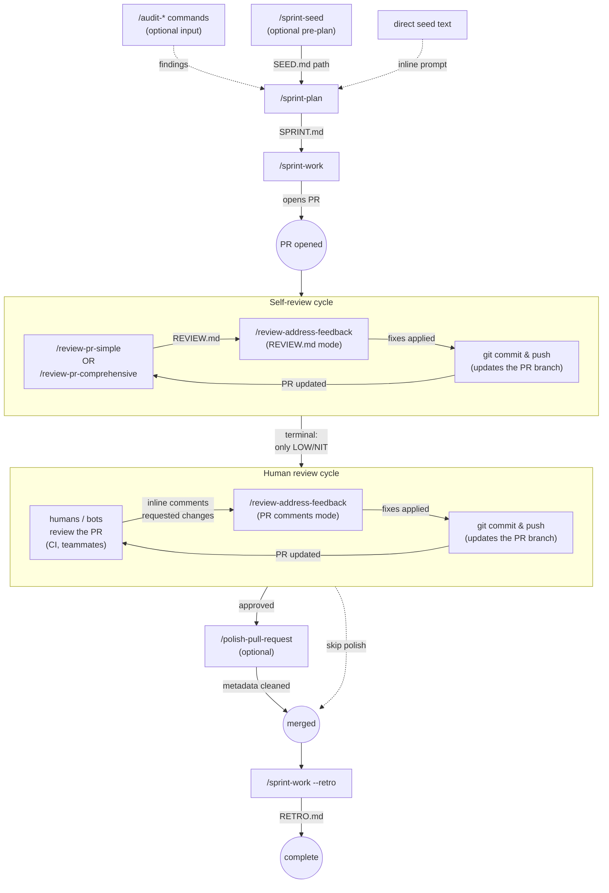

# Sprint Workflow

End-to-end lifecycle for planning, executing, reviewing, and shipping
work in this sandbox. Each stage has a dedicated skill; this doc shows
how they compose.

For details on any single skill's phases and inputs, see
`skills/<skill>/SKILL.md`.

---

## Lifecycle

*Renders natively on GitHub. In VS Code, install [Markdown Preview Mermaid Support](https://marketplace.visualstudio.com/items?itemName=bierner.markdown-mermaid) to render in the built-in preview.*



**Pre-plan options** feeding into `/sprint-plan` are all optional and
mutually-mixable: pass an audit report as the seed, write a `SEED.md`
via `/sprint-seed` first, or just hand `/sprint-plan` an inline seed
prompt directly.

**Review/fix cycle** (`/review-pr-*` ↔ `/review-address-feedback`)
runs as many iterations as needed until terminal — see the *Review →
Fix Cycle* section below.

---

## Skills by stage

| Stage | Skill | Output |
|---|---|---|
| Audit (optional input) | `/audit-architecture` `/audit-design` `/audit-security` `/audit-accessibility` | Findings written as sprint-able tasks |
| Pre-plan discussion (optional) | `/sprint-seed` | `SEED.md` (refined seed prompt + discussion summary) in a fresh session folder |
| Plan | `/sprint-plan` | `SPRINT.md` + supporting drafts/critiques/reviews |
| Ledger | `/sprints` | `ledger.tsv`; lookup by `--current` / `--path <query>` (session prefix or title fragment) |
| Execute | `/sprint-work` | Code changes + PR(s) opened from `SPRINT.md`, multi-repo aware. |
| Review (single agent) | `/review-pr-simple` | `REVIEW.md` |
| Review (dual agent) | `/review-pr-comprehensive` | `REVIEW.md` (Claude + Codex synthesis) |
| Address feedback | `/review-address-feedback` | Code changes + `ADDRESSED.md` |
| Pre-merge polish (optional) | `/polish-pull-request` | Updated PR title/body + resolved stale threads |
| Retro | `--retro` flag on `/sprint-work` | `RETRO.md` |

---

## Execution flow

```
/sprint-plan → /sprint-work → PR → review/fix cycle → merge → retro
```

`SPRINT.md` is the source of truth for tasks. The ledger tracks
sprint state (status, model, model-fit verdict).

---

## The review → fix cycle

A PR is rarely accepted on first review. Treat review and fix as a
loop, not a single pass.

### How the cycle works

1. **Review** — run `/review-pr-simple` or `/review-pr-comprehensive`
   against the PR. Output: `REVIEW.md` with severity-tagged findings
   (Blocker / High / Medium / Low / Nit).

2. **Address feedback** — run `/review-address-feedback` pointed at
   that `REVIEW.md` (or the live PR comments). For each finding the
   user picks: **fix** / **skip** / **won't-fix** / **defer** /
   **discuss**.

3. **Re-review** — run a review skill again against the updated code.

4. **Stop when terminal:** the PR has zero Blocker / High findings and
   only Low / Nit findings remain (or none at all).

You can drive the cycle manually, alternating the two skills as many
times as needed. `/loop` could automate the loop, but **a review/fix
cycle should always have a terminal condition you check between
iterations** — fully unattended loops hide regressions and waste
budget. Review the output between iterations.

### Deferring findings — route them to Obsidian or just record

Some findings are real but not in scope for the current PR. Defer them
with `/review-address-feedback`'s **defer** action and choose either
**Obsidian task** (creates a note in the vault via the `create-task`
skill) or **just record** (notes the deferral in `ADDRESSED.md` only).

When the deferred work would live at a specific spot in the code, the
skill also offers to leave a marker comment at that file:line:

```go
// TODO: handle the empty-batch case once the upstream API
// stops returning nil for empty queries.
```

The marker makes the gap **discoverable at the code site** so future
readers see it in context. A `grep -rn 'TODO:' .` produces a complete
list of deferred items in the codebase.

### ID Suppression Rule (applies across the cycle)

Internal review-finding IDs (`R001`, `SR042`, `CR007`, `CX012`, etc.)
are scratch artifacts of the review process. They live only in
`REVIEW.md` and `ADDRESSED.md`. They **must never appear in**:

- code, code comments, or commit messages
- PR titles, PR bodies, or PR replies
- any user-facing summary

`/review-address-feedback` enforces this rule directly. Other skills
in the cycle (`/review-pr-*`, `/polish-pull-request`) inherit it —
when they generate or rewrite text that lands in code, commits, or
PR replies, they must suppress internal review IDs.

### Acceptable terminal states

| State | Action |
|---|---|
| Zero findings | Merge. |
| Only Low / Nit findings remaining, all triaged (fixed / won't-fix / deferred) | Merge. |
| Medium findings remaining | Address or defer with explicit reason; don't merge. |
| Any High / Blocker finding remaining | Don't merge — keep the cycle going. |

---

## Artifact map

Everything lives under `~/Reports/<org>/<repo>/`, derived from
`git remote get-url origin`. Nothing is written into the project repo.

```
~/Reports/<org>/<repo>/
├── ledger.tsv                                    # sprint index
└── sprints/
│   └── YYYY-MM-DDTHH-MM-SS/                      # one folder per planning session
│       ├── intent.md
│       ├── claude-draft.md
│       ├── codex-draft.md                        # if Phase 5b ran
│       ├── ...                                   # critiques, reviews
│       ├── SPRINT.md                             # the plan
│       └── RETRO.md                              # written by /sprint-work --retro
└── pr-reviews/
│   └── pr-N/
│       ├── YYYY-MM-DDTHH-MM-SS/                  # one folder per review run
│       │   └── REVIEW.md  diff.patch  ...
│       └── YYYY-MM-DDTHH-MM-SS-addressed/        # one folder per address-feedback run
│           └── ADDRESSED.md
└── <TS>-audit-<lens>-{claude,codex,synthesis,devils-advocate,report}.md
                                                  # audit artifacts, flat, timestamp-prefixed
```

The ledger's `session` column points each sprint at its folder; the
folder timestamp is the only identifier (sprint numbers live in the
ledger and inside `SPRINT.md`, not in any path).

---

## Common scenarios

**"I just finished an audit. What now?"**
Run `/sprint-plan` with the audit report path as your seed prompt. The
plan will use the audit findings as the basis for tasks.

**"I have a fuzzy idea I want to talk through first."**
`/sprint-seed "<rough idea>"` → discuss → produces `SEED.md` →
`/sprint-plan <path-to-SEED.md>`. Same session folder for both.

**"I don't know what to work on next."**
`/sprint-seed` (no args, from a repo directory) → agent surveys
`~/Reports/<org>/<repo>/` and proposes 2–3 next-step candidates
based on past sprints / retros / git log.

**"I'm starting fresh on a sprint."**
`/sprint-plan` → review/approve → `/sprint-work` to execute.

**"I'm picking up an in-flight sprint."**
`/sprint-work` with no argument resolves the current in-progress
sprint from the ledger; `/sprint-work <query>` resolves by
session timestamp, prefix, or title fragment.

**"My PR has review comments to address."**
`/review-address-feedback <PR-url>` and walk through them. If a
finding is real but out of scope, defer to an Obsidian task or
record-only with a code marker.

**"I want a fresh review on my PR."**
`/review-pr-simple <PR-url>` for a quick check, or
`/review-pr-comprehensive <PR-url>` for a dual-agent review with
synthesis.

**"I want to revise a sprint plan mid-flight."**
For now, re-run `/sprint-plan` — it produces a new session folder.
Mid-sprint amendment isn't a first-class flow yet (see Known Gaps).

---

## Known gaps

Future work that hasn't shipped:

- **Mid-sprint amend.** Re-running `/sprint-plan` produces a new
  session folder rather than updating the existing one. Fine for short
  sprints; bites if you find yourself wanting to revise mid-flight.

---

## Pointers

| Need details on... | Read |
|---|---|
| Pre-plan discussion / seed shaping | `skills/sprint-seed/SKILL.md` |
| Phase-by-phase planning workflow | `skills/sprint-plan/SKILL.md` |
| Sprint execution | `skills/sprint-work/SKILL.md` |
| PR review (single agent) | `skills/review-pr-simple/SKILL.md` |
| PR review (dual agent) | `skills/review-pr-comprehensive/SKILL.md` |
| Address PR feedback | `skills/review-address-feedback/SKILL.md` |
| Pre-merge PR polish | `skills/polish-pull-request/SKILL.md` |
| Sprint ledger / velocity | `skills/sprints/SKILL.md` |
| Audit lenses | `subagents/audit-*.md` |
